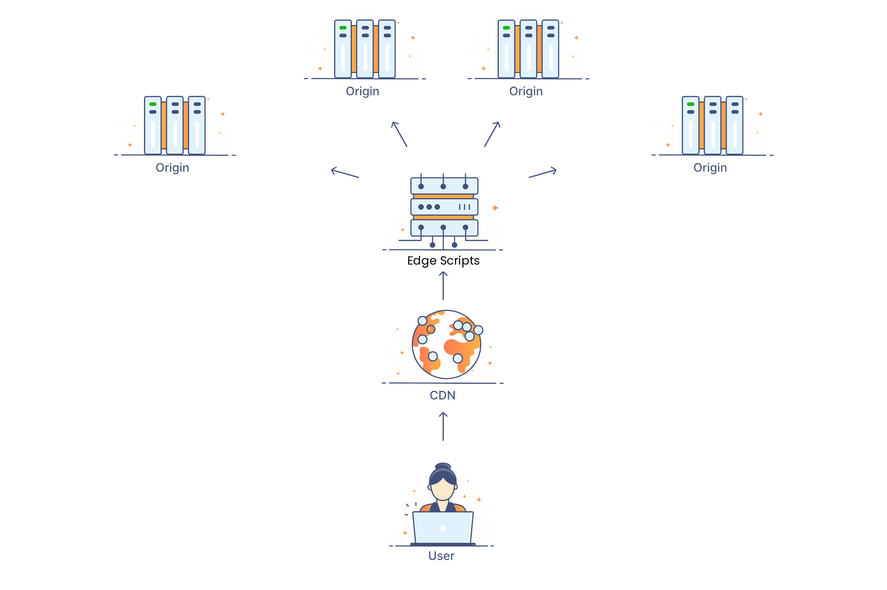
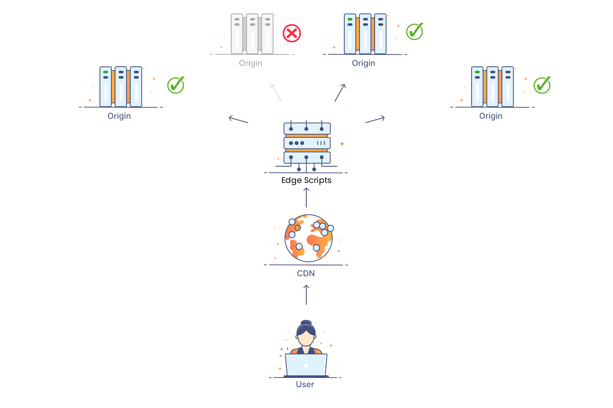
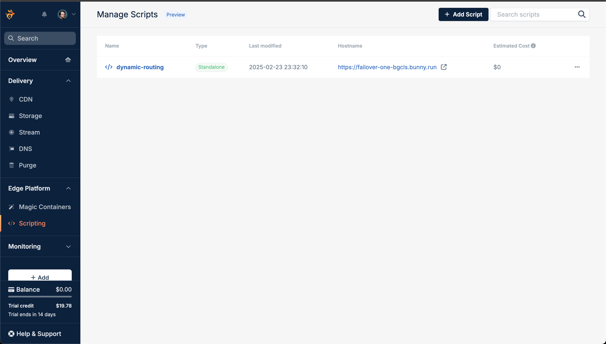
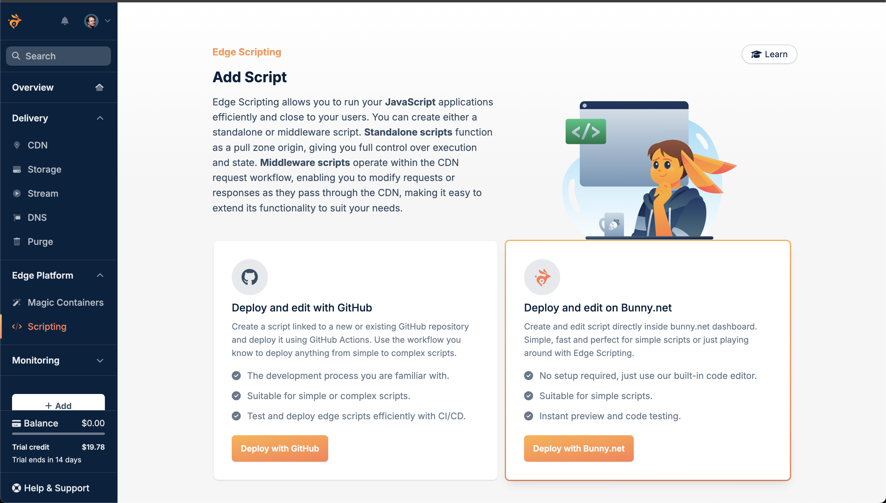
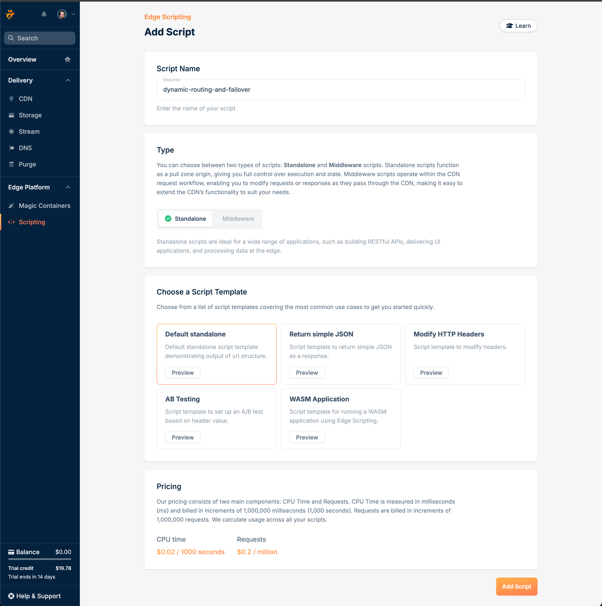
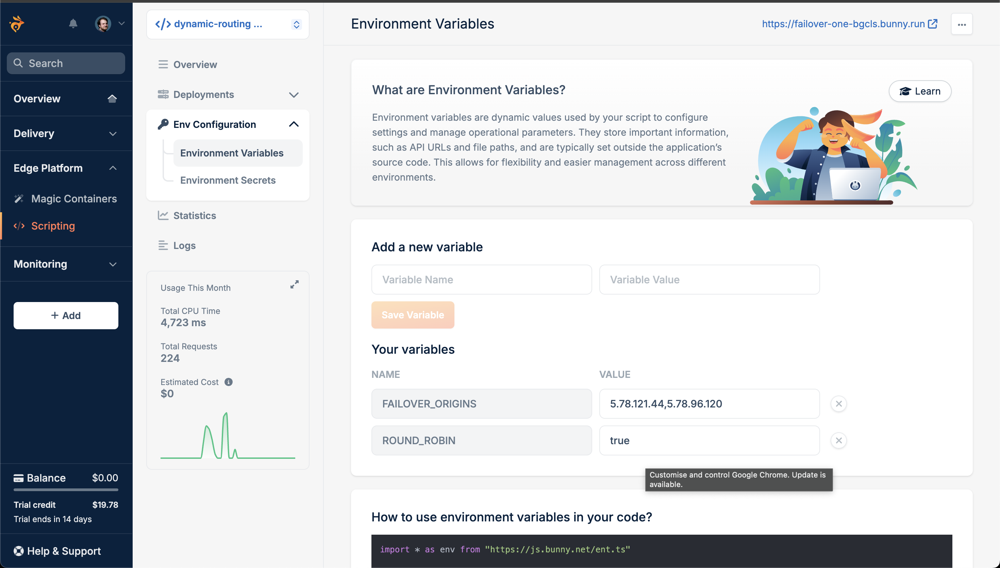
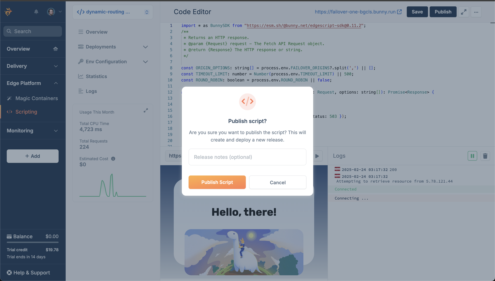
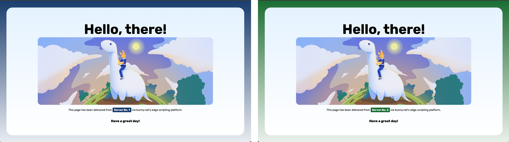

# Dynamic routing and Failover with Bunny Edge Scripting

A little while ago, we were super-excited to [announce Bunny Edge Scripting to the world](https://bunny.net/blog/introducing-bunny-edge-scripting-a-better-way-to-build-and-deploy-applications-at-the-edge/). Since then, we've seen so many exciting and creative uses that people have come up with for Edge Scripts, and we wanted to show you something that we thought was really cool: Dynamic Routing and Failover of network requests!

At the edge of the internet, speed is everything. With Bunny Edge Scripting, you can now route traffic dynamically and failover effortlessly!

## What is Dynamic Routing and Failover?



“Dynamic routing” usually refers to code that enables us to programmatically determine the path traffic takes from a user to one or more servers. Developers can decide which requests go to which server based on factors like location, browser type, and more!



"Failover" is pretty much the same thing, except it's specifically intended to handle situations where one or more servers powering your service has gone down and traffic needs to be routed to healthy instances instead.

## Why is this important?

When your web service handles thousands - or even millions(!) - of users, you inevitably rely on multiple servers. But the more servers you add, the harder it gets to distribute traffic without overloading any single machine. If one server goes down, users could face dreaded 404 errors or even worse, complete downtime!

That’s where Bunny’s Edge Scripts shine. With a few lines of code, you can programmatically route requests across healthy servers without having to change a thing about your existing set-up. Imagine customers never seeing a 404 again! 🎉

## Let's Get Building!

Let's dive straight in! We're going to work directly with Edge Scripting's built-in UI to code and deploy our dynamic routing and failover code.

First, head over to the [Edge Scripting](https://dash.bunny.net/scriptsg) dashboard and click the "Add Script" button at the top-right to begin the process of creating a new script.



### Setting Up

You'll be taken through to the "Add Script" screen, which gives us two options - we're gonna dive straight in and select "Deploy and Edit on Bunny.net".



We'll need to enter a couple of details and make a few decisions before we get to writing our script.

First up, give your script a name - I've called mine "dynamic-routing-and-failover" but you can call yours whatever you like.



The rest of the settings we can leave as defaults. Once you're happy with the name, hit the "Add Script" button at the bottom to create it!

### Coding our handler

Next, we'll be taken through to the WebUI where we can edit our script. To start with, we get a tiny bit of code which lets us respond to HTTP requests. We also get a little preview window where we can see how our Edge Script responds to a request.

When we've finished our Edge Script it will take any incoming request and pass it through to a target origin to get the requested resource. If the server is live, we send the response to the user. If the target is offline, we'll then work through the other options until we find a live server and get the resource from there. 

If no server is found (oh no!) we'll fail gracefully and let the user know something went wrong.

(If you just want to look at the code instead of working through the steps, you get a full example [here](https://gist.github.com/seanmtracey/52aaec096dbbdb925c420b7909ca16f6)).

### Setting Some Default Values

Let's add some variables at the start of our script to help control the flow of the request, and replace the default code in our default handler:

```typescript
import * as BunnySDK from "https://esm.sh/@bunny.net/edgescript-sdk@0.11.2";

/**
 * Returns an HTTP response.
 * @param {Request} request - The Fetch API Request object.
 * @return {Response} The HTTP response or string.
 */

// Add these variables here.
const ORIGIN_OPTIONS: string[] = process.env.FAILOVER_ORIGINS?.split(',') || [];
const TIMEOUT_LIMIT: number = Number(process.env.TIMEOUT_LIMIT) || 500;
const ROUND_ROBIN: boolean = process.env.ROUND_ROBIN || false;

// Code Block 2
// ...

BunnySDK.net.http.serve(async (request: Request): Response | Promise<Response> => {
    
    // Then replace the default code with the following...
    return await requestContentFromOriginOptions(request, ORIGIN_OPTIONS);
    // ... We'll add this method next...

});
```

We'll use each of the variables we've set as follows:

1. `ORIGIN_OPTIONS` will have all of the origins available to our Edge Script for retrieving requested resources.

2. `TIMEOUT_LIMIT` sets how long the script waits for a response before trying the next server. Keep it short to avoid extended waits if multiple servers fail at once.

3. `ROUND_ROBIN` is a boolean that we can set to decide if we want to work through our origin servers in order, or if we want to pick one at random.

We'll set all of these values using environment variables shortly, but for now, the default values will do the trick!

Finally, we've updated our default request handler to call `requestContentFromOriginOptions` which we'll call to handle all requests/responses for us.

### Handling Requests

We're going to break out our logic to a separate function which enables us to simplify handling routing and failovers by having a single place to call when we want to find an origin that works.

In the previous code snippet, there's a line which reads `// CODE BLOCK 2`, add the following code just below that line to your script:

```typescript
async function requestContentFromOriginOptions(request: Request, options: string[]): Promise<Response> {

    if (options.length === 0) {
        console.log("No more origins to try.");
        return new Response("Service unavailable", { status: 503 });
    }

    let selectedOrigin: string;

    if(ROUND_ROBIN === false){
        selectedOrigin = options.shift();
    } else {
        selectedOrigin = options.splice(Math.random() * options.length | 0, 1)[0];
        options = options.filter(item => item != null);
    }

    if (!selectedOrigin) {
        console.error("No selected origin.");
        return new Response("Service unavailable", { status: 503 });
    }

    console.log(`Attempting to retrieve resource from ${selectedOrigin}`);

    const url = new URL(request.url);
    const fetchUrl: string = `http://${selectedOrigin}${url.pathname}`;

    const controller: AbortController = new AbortController();
    const timeout: NodeJS.Timeout = setTimeout(() => {
        controller.abort();
    }, TIMEOUT_LIMIT);

    // CODE BLOCK 3
    // ...

}
```

Our `requestContentFromOriginOptions` method accepts two arguments: 

1. The request object that gets passed through from our default handler.
2. A list of origins that we can use to request resources from.

In this block of code, we first check whether or not we have any origins available to us to pass requests to. If not, we fail the request immediately, but that should happen rarely (if ever!).

Next, we'll pick an origin from our array of options that we pass when calling `requestContentFromOriginOptions`. If we're not doing a round-robin look-up, then we'll just pick the first option in the array. If we are, we'll pick one at random. 

If somehow no origin is selected, we'll again fail the request.

Finally, we use the requesting URL to create a new URL but with our selected origin instead of the original one, and set-up an `AbortController` which we can use to force the subsequent fetch request to fail if it takes too long.

### Making a Request

In this next block, we'll use the [Fetch API](https://developer.mozilla.org/en-US/docs/Web/API/Fetch_API) to make a request to our selected origin server for resources.

Under `// CODE BLOCK 3` add the following:

```typescript
try {

    const rawReq: Response = await fetch(fetchUrl, {
        signal: controller.signal
    });

    clearTimeout(timeout);

    console.log(rawReq.status);

    if (rawReq.status !== 200) {
        // Retry with the next origin
        return await requestContentFromOriginOptions(request, options);
    } else {
        return rawReq;
    }

} catch (error: unknown) {
    clearTimeout(timeout);

    if (error instanceof Error) {
        if (error.name === 'AbortError') {
            console.error(`Request to ${selectedOrigin} timed out.`);
        } else {
            console.error(`Error retrieving from ${selectedOrigin}:`, error.message);
        }
    } else {
        console.error(`Unknown error occurred while fetching from ${selectedOrigin}`);
    }

    // Retry with the next origin on error
    return await requestContentFromOriginOptions(request, options);
}
```

First, we `await` a fetch request to the URL we constructed in `CODE BLOCK 2` to get the requested resource from our origin server. If the request resolves before the timeout value (500ms), then we clear the `timeout` timer, and if the status code of the response is `200`, we return the result to the user. Job done!

Well, not quite. We still need to handle the situations where either the request fails or takes too long to respond.

In both cases, we take the exact same approach to remedy each issue. We call `requestContentFromOriginOptions` again - but each time we do, we pass through a modified options array which no longer has the origin that failed to handle our request - along with the original request object.

With this approach, requests will be made to each origin until we either get a successful result, or we run out of options. 

Click the "Save" button at the top-right of the UI when you've finished adding your Edge Script code.

### Setting Origin Servers

Before we run our Edge Script, we need to set the `ORIGIN_OPTIONS` environment variable for our script so it knows which servers it can use to make requests to.



Click the "Env Configuration" list item just to the left of your code editor. In the "Add new variable" section of the page, set the variable name as "ORIGIN_OPTIONS" and the value as "5.78.121.44,5.78.96.120".

These are the IP addresses of two demo servers we've spun up for you to try, but it can be any IP address or hostname you want to test against. Just remember to have each origin be separated by a comma, with no spaces between the values.

Once you've entered those values, click "Save Variable" and then head back to the code editor by clicking on "Overview" button to the side.

### Running our Edge Script

And that's it - a dynamic routing and failover handler in just 80 lines of TypeScript!

Now that our script is ready, we can publish it and start making requests.



Click the "Publish" button at the top right of the UI, and then click on the URL for your Edge Script just to the left of it. This will open up a new tab in your browser, and if everything is working properly, you should see one of the two following pages!



If you didn't set the `ROUND_ROBIN` variable to `true` in your environment variables, you should see the blue demo page coming from the first of our two servers. If you did, then there's a 50% chance you'll either get the blue page from server 1, or the green page from server 2.

## That's All, Folks!

And there you have it! Dynamic Routing and Failover in just a few lines of code! 

Whether you’re launching a brand-new app or scaling an existing platform, Bunny Edge Scripting puts robust performance and resiliency right at your fingertips. 

By programmatically directing requests, you can keep traffic flowing smoothly even when servers go offline - no more frantic late-night fixes or angry 404s!
